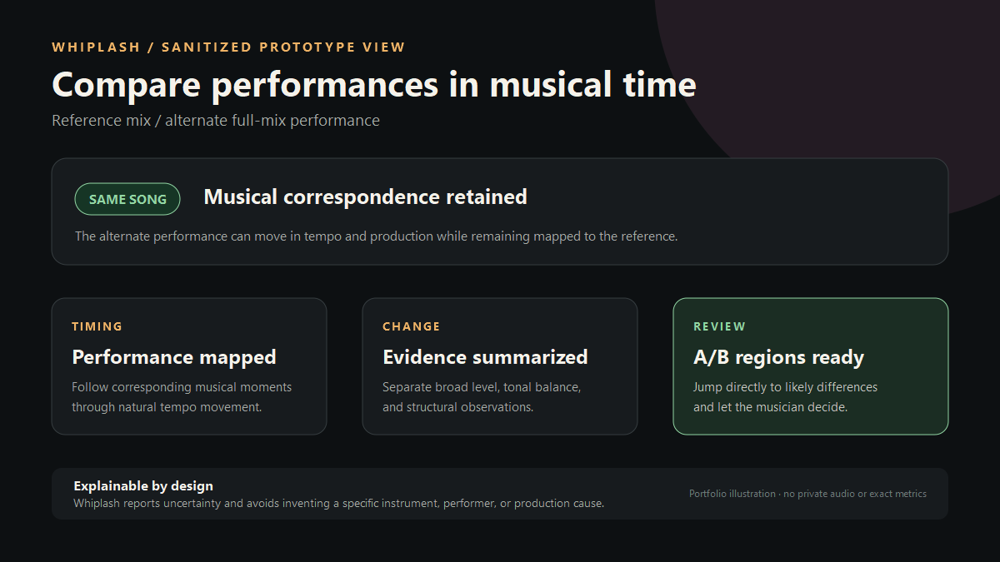
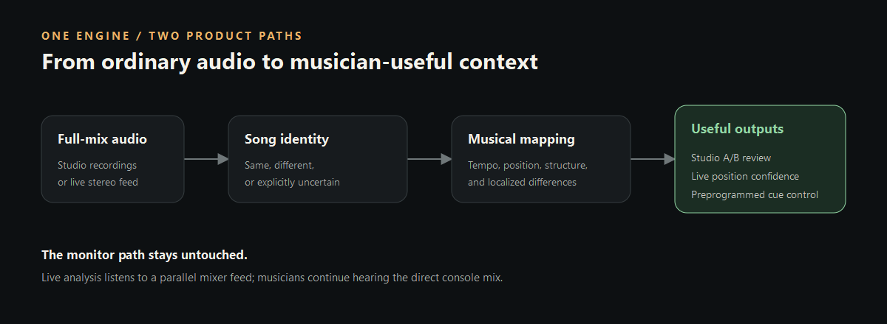

# Whiplash

**Musician-first recording comparison and live performance tracking.**

Whiplash is the working codename for a private commercial prototype built around a shared,
explainable audio-analysis engine. It is designed for musicians, live technicians, and independent
recordists who need useful answers without reading waveforms or signal-processing diagnostics.

The first product path compares two full-mix recordings and maps where a performance or production
changed. The same engine is intended to follow a live band later, allowing preprogrammed lighting
and show-control cues to remain synchronized even when musicians do not perform to a backing track.

> **Status:** active pre-alpha research and development. The interface shown here is a sanitized
> representation of a working private prototype, not a released product or calibrated safety claim.

## The problem

Musicians often keep many renders, rehearsals, and live recordings of the same material. Ordinary
version-control tools can preserve the files, but they cannot explain musically meaningful changes
or follow a human performance whose tempo and structure move naturally.

Whiplash is being designed to answer questions such as:

- Are these recordings performances or renders of the same song?
- Where did their timing, form, level, or tonal balance meaningfully diverge?
- Which mapped regions should a musician audition first?
- During a live performance, where is the band within the expected song?
- Is the evidence strong enough to act on, or should the system remain explicitly uncertain?

## Prototype capabilities

- Works from ordinary mono or stereo full-mix recordings.
- Preserves same-song identity across substantial tempo and production changes in controlled tests.
- Maps corresponding musical time and highlights localized review regions.
- Produces a local A/B comparison report for musician-led verification.
- Separates song identity from change evidence so a production difference does not automatically
  become an identity failure.
- Uses deterministic, CPU-side analysis; the current engine does not require AI or a network
  connection at runtime.
- Prefers a transparent `uncertain` result over an unsafe forced match.

The current research corpus also includes deliberately difficult cross-arrangement and
near-neighbor material. Those tests expose important unsolved cases, especially when the same
composition changes dramatically between a sparse acoustic performance and a faster full-band
arrangement.

## One engine, two product paths

### Studio comparison

Two known recordings are analyzed and mapped. Whiplash presents musician-readable findings and
selectable A/B regions while avoiding unsupported claims about the exact player, instrument,
plugin, or mix control responsible for a change.

### Live tracking

A parallel mixer feed is compared with the expected song in the setlist. The planned output is
position, confidence, ambiguity, and reacquisition data for lighting or other show-control systems.
Whiplash is not inserted into the musicians' monitor-audio path.

## Design principles

- Explain evidence instead of returning only a confidence score.
- Treat count-ins, pickups, tempo changes, repeats, and musician-authored sections as musical data.
- Support performances that begin late, add or remove bars, or briefly lose usable audio.
- Keep the core engine portable across Windows, macOS, and ARM/Linux targets.
- Review every dependency and test asset for commercial-use compatibility.
- Keep all private recordings local and outside public source control.

## Development snapshot

The private prototype is written in Rust and currently includes a command-line evaluation harness
and a standalone browser-based A/B report. Development is focused on improving cross-performance
identity, live incremental tracking, confidence calibration, and musician usability before broader
product integration.

The implementation, research records, exact evaluation data, and test recordings are intentionally
not published in this repository.

## Ownership

Whiplash is an independent project by **Xavier Wells**. This repository is a portfolio presentation,
not an open-source distribution. See [NOTICE.md](NOTICE.md) for usage terms.
